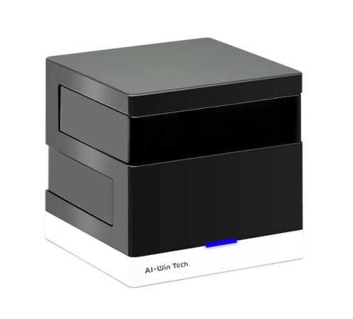
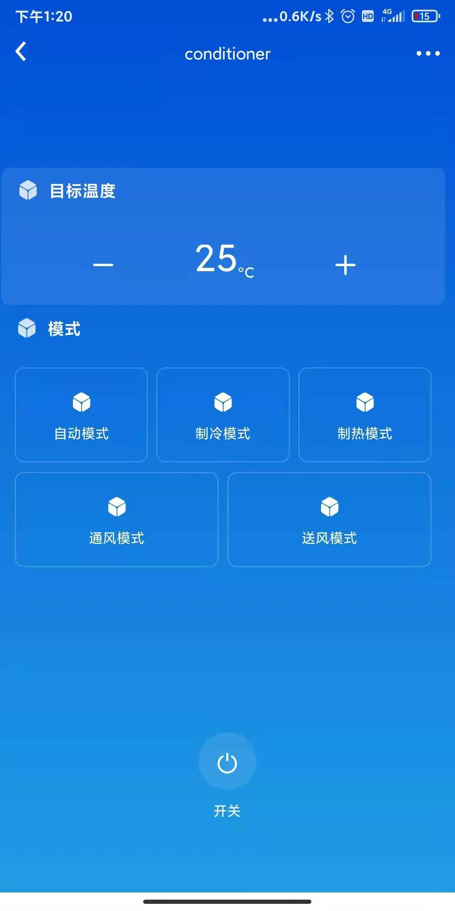

# ESP8266_ALIYUN_IR
## 使用ESP8266接入阿里云实现红外控制，红外码库使用IRext, 支持1000多种品牌，6000多种型号

以下艾韵智能场景控实现空调遥控，艾韵智能场景控服务器已经关闭，APP无法再使用，所以价格也很便宜，应该是比较理想的硬件方案了

 

### 使用说明
1. 搭建[ESP8266_RTOS_SDK](https://docs.espressif.com/projects/esp8266-rtos-sdk/en/latest/get-started/index.html)编译环境
2. 使用[阿里云生活物联网平台](https://living.aliyun.com/)创建红外遥控项目
3. 获取设备证书，烧录到设备中，或者使用menuconfig，配置到项目中
4. 修改代码，只用修改main/app_main.c中的aliyun_set_property_cb实现相关的控制逻辑即可(已实现空调控制的例程，相关属性由阿里云项目决定，红外库协议可由IRext控制台进行查找)。
5. 烧录程序

### 其他功能
* 待说明

### 相关库
* [esp-aliyun](https://github.com/espressif/esp-aliyun)
* [flexible_button](https://github.com/murphyzhao/FlexibleButton)
* [http](https://github.com/alibaba/AliOS-Things/tree/master/components/http)
* [esp-ir](https://github.com/maximkulkin/esp-ir)
* [letter-shell](https://github.com/NevermindZZT/letter-shell)